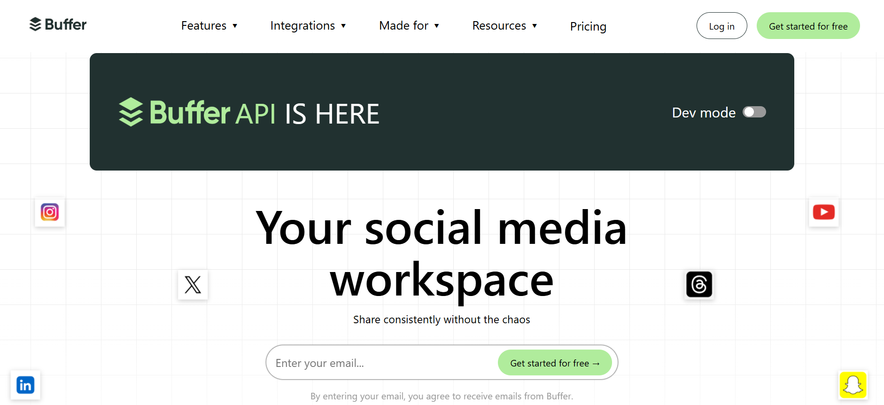

# Buffer Clone

A responsive landing page inspired by the Buffer website, built from scratch using HTML5 and CSS3.

This project recreates the visual structure and layout of a modern social media management platform, with a focus on responsive design, CSS organization, and frontend development.

## 📸 Preview



## ✨ Features

- Responsive navigation bar
- Responsive hero section
- About/intro sections
- Audience section
- Features sections
- Statistics section
- Favourite accounts section
- Customer support section
- Resources section
- Get Started call-to-action section
- Responsive footer
- Mobile-friendly layouts

## 🛠️ Built With

- HTML5
- CSS3
- Flexbox
- CSS Grid
- CSS Media Queries

## 📁 Project Structure

```text
Buffer Clone/
│
├── Images/
│   ├── Buffer logos
│   ├── Social media icons
│   ├── Feature images
│   ├── Customer images
│   └── Resource images
│
├── css/
│   ├── buffer-navbar.css
│   ├── buffer-hero.css
│   ├── buffer-aboutus-section.css
│   ├── buffer-audience-section.css
│   ├── buffer-features-section.css
│   ├── buffer-features-section-2.css
│   ├── buffer-stats-section.css
│   ├── buffer-favourite-accounts.css
│   ├── customer-support-section.css
│   ├── buffer-resources-section.css
│   ├── buffer-get-started-card.css
│   └── buffer-footer-section.css
│
└── index.html
```

## 📱 Responsive Design

The project is designed to provide a responsive experience across different screen sizes.

The layout adapts to:

- Desktop screens
- Tablet screens
- Mobile devices

CSS media queries are used to adjust the layout, spacing, sizing, and positioning of different sections for smaller screens.

## 🎯 Purpose

This project was created as a frontend development practice project to strengthen my understanding of HTML and CSS by recreating a real-world website layout from scratch.

The main goals of the project were to practice:

- Structuring a complete webpage using HTML
- Creating responsive layouts with CSS
- Using Flexbox and CSS Grid
- Working with CSS media queries
- Organizing styles into separate CSS files
- Managing images and frontend assets
- Recreating complex website sections
- Improving attention to spacing, alignment, typography, and layout

## 📚 What I Practiced

Through this project, I practiced building a complete multi-section landing page while keeping the HTML structure, CSS styles, and assets organized.

The project also provided hands-on experience with adapting a desktop-oriented design to smaller screen sizes and maintaining a consistent visual structure across different devices.

## 🚀 Getting Started

To run the project locally:

### 1. Clone the repository

```bash
git clone https://github.com/naman-gudhka/buffer-landing-page-clone.git
```

### 2. Open the project

```bash
cd buffer-landing-page-clone
```

### 3. Run the project

Open `index.html` in your browser.

For development, you can also use the Live Server extension in Visual Studio Code.

## 🌐 Live Demo

[View Buffer Clone](https://naman-gudhka.github.io/buffer-landing-page-clone/)

## 👨‍💻 Author

**Naman Gudhka**

GitHub: [@naman-gudhka](https://github.com/naman-gudhka)

## ⚠️ Disclaimer

This is an educational frontend practice project inspired by the Buffer website.

It is not affiliated with, endorsed by, or officially connected to Buffer.

Buffer's name, branding, logos, trademarks, and other brand-related assets belong to their respective owners.

The purpose of this project is solely to practice and demonstrate frontend development skills.

## ⭐ Acknowledgement

This project was created for learning and practicing frontend web development, particularly HTML, CSS, responsive design, webpage structure, and CSS organization.